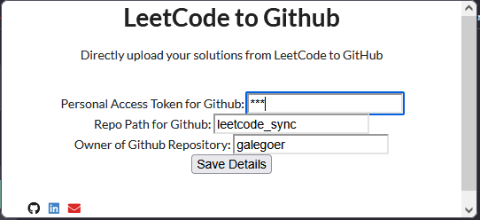
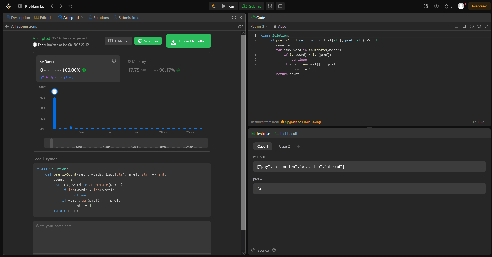

# Leetcode Sync

This is Leetcode Sync, a program that helps you synchronize your leetcode solved solutions with your Github account using a github access token. It submits your working solution along with a README explaining the problem and your stats regarding your solution compared to other Leetcode solutions.

**Please refer to the Notes section for further information before using this program.**

## Obtaining a Personal Access Token:
Once signed into your Github account:

Go to your Settings > Developer Settings > Personal Access Tokens > Choose either option (Fine-grained or Personal Access Tokens)

**NOTE:** Ensure your token has the ability to read and write to your respective repository you plan on submitting your solutions to.

Next input these values into the extension:

**Note:** For nested directories where you want the solutions stored add "/" respectively to the repo path.

## Example View:

Here is the solution example after clicking upload:
https://github.com/galegoer/leetcode_sync/tree/main/2185-counting-words-with-a-given-prefix

## Notes:
- Do not try this with an empty repository your repository must have at least one commit on it to work. 
- This program will commit directly to main branch.
- Currently you must go to your leetcode submission under submissions click on the one you would like to submit and refresh the page for the submit button to appear
- Currently if you upload to the same path with the same file it will replace your current solution

## TODO / Goals:
- Would prefer solution button to popup when you click on the submission rather than having to refresh the page when you are at the submission url
- Images added to your submission when submitting solutions where the description includes images
- Submit multiple solutions with same filetype
- Option for branches or branching